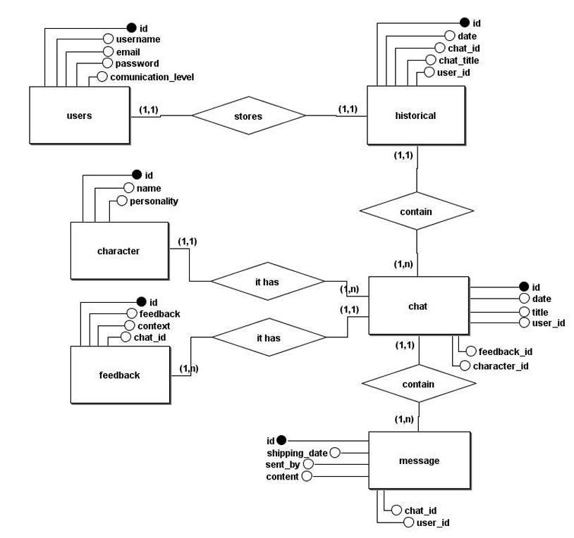

# AutisMind Backend

Essa é a **API REST do AutisMind**, desenvolvida em Node.js, que oferece recursos para cadastro, autenticação, gerenciamento de usuários, personagens, chats, mensagens e históricos. Ela serve como backend para a aplicação que é voltada ao suporte de pessoas com Neurodivergência, e dificuldades na conversação, permitindo integração com bancos de dados MySQL e autenticação JWT.

---

## 📋 Índice

- [Tecnologias Utilizadas](#tecnologias-utilizadas)
- [Estrutura do Projeto](#estrutura-do-projeto)
- [Configuração do Ambiente](#configuração-do-ambiente)
- [Instalação](#instalação)
- [Execução](#execução)
- [Banco de Dados](#banco-de-dados)
- [MER do Banco](#mer-do-banco-de-dados)
- [Contribuição](#contribuição)
- [Contato](#contato)

---

## 🛠 Tecnologias Utilizadas

- **Node.js**: Ambiente de execução JavaScript.
- **MySQL**: Banco de dados relacional.
- **dotenv**: Gerenciamento de variáveis de ambiente.
- **JWT**: Autenticação de usuários.
- **Cors**: Permite que aplicações front-end de outros domínios acessem a API com segurança.
- **bcrypt**: Hashing de senhas.
- **mysql2**: Biblioteca para conexão com o MySQL.
- **Swagger**: Biblioteca para documentar a API.

---

## 📂 Estrutura do Projeto

```plaintext
backend/
├── docs/
|   └── swagger.js           # Objeto com a estrutura da documentação
├── src/
│   ├── class/               # Classes principais do sistema
│   │   ├── Usuario.js
│   │   ├── Personagem.js
│   │   ├── Conversa.js
│   │   ├── Historico.js
│   ├── database/            # Configuração do banco de dados
│   │   ├── Pool/
│   │   │   └── Pool.js
│   │   ├── DatabaseQuery.js
│   │   └── querys/
│   │       ├── ChatQuerys.js
│   │       ├── CharacterQuerys.js
│   │       ├── HistoricalQuerys.js
│   │       ├── MessageQuerys.js
│   │       └── UserQuerys.js
|   ├──utils/
|   |  ├── Auth.js           # Autenticação de usuários
|   |  └── verify.js         # Validação de entrada
│   ├── App.js               # Arquivo principal para execução
├── .env                     # Variáveis de ambiente
├── package.json             # Dependências do projeto
└── README.md                # Documentação do projeto
```

---
## ⚙️ Configuração do Ambiente

1. Renomeei o arquivo `.env.example` para `.env`, e configure as seguintes variáveis:

    ```bash
    JWT_SECRET=
    JWT_EXPIRATION=
    PORT=
    HOST=
    DB_NAME=
    DB_HOST=
    DB_PORT=
    DB_USER=
    DB_PASSWORD=
    DB_DIALECT=
    EMAIL_ADM=
    ```

2. Certifique-se de que o MySQL está instalado e configurado no seu sistema.

---

## 🚀 Instalação

1. Clone o repositório:
    ```bash
    git clone https://github.com/Mikaelpeganinguem/platform-AutisMind.git
    ```

2. Instale as dependências:
    ```bash
    npm install
    ```

3. Configure o banco de dados:
    - O banco de dados e as tabelas serão criados automaticamente ao iniciar o sistema.

---

## ▶️ Execução

Para iniciar o sistema, execute o seguinte comando no terminal:

```bash
node src/App.js
```

No terminal você terá dois logs na tela, com as seguintes rotas:

Server is running on port:
```bash
http://localhost:${PORT}
```

API documentation available at 
```bash
http://${HOST}:${PORT}/api/api-docs
```

---

## 🗄 Banco de Dados

O banco de dados contém as seguintes tabelas:

- **users:** Armazena informações dos usuários.
- **character:** Armazena informações dos personagens.
- **message:** Armazena mensagens enviadas em chats.
- **chat:** Armazena informações dos chats.
- **historical:** Armazena dados históricos relacionados aos usuários.

---

## MER do Banco de Dados



---

## 🤝 Contribuição

1. Faça um Fork do projeto.
2. Crie uma branch para sua feature:
    ```bash
    git checkout -b minha-feature
    ```

3. Faça commit das suas alterações:
    ```bash
    git commit -m "Minha nova feature"
    ```

4. Envie para o repositório remoto:
    ```bash
    git push origin minha-feature
    ```

5. Abra um Pull Request.

---

## 📧 Contato

Se você tiver alguma dúvida ou quiser discutir sobre o projeto, pode entrar em contato!

**Mikael Carlos**
- E-mail: carlosmikael273@gmail.com
- GitHub: [MIkaelpeganinguem](https://github.com/MIkaelpeganinguem)


Estou aberto para sugestões e contribuições!


> Mikael Carlos