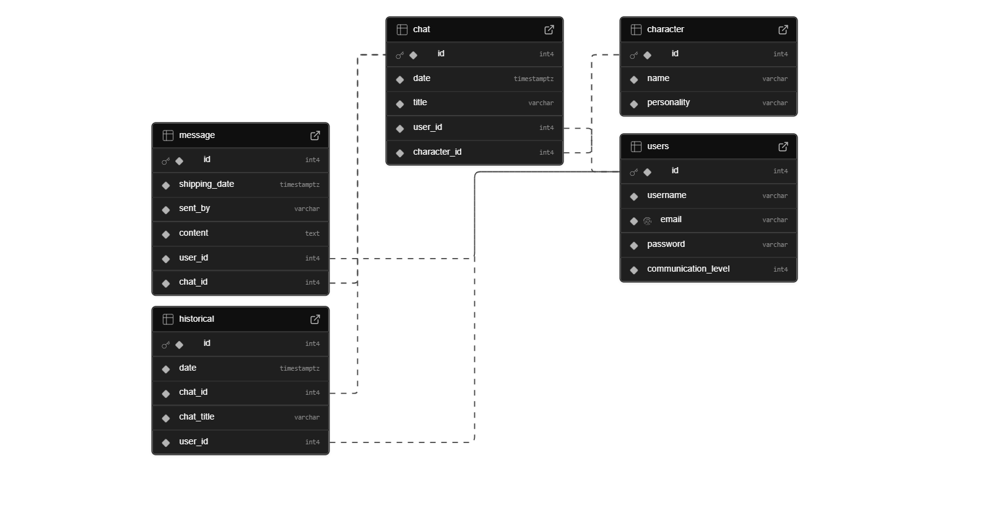

# 🗄 Banco de Dados

O banco de dados contém as seguintes tabelas:

- **users:** Armazena informações dos usuários.
- **character:** Armazena informações dos personagens.
- **message:** Armazena mensagens enviadas em chats.
- **chat:** Armazena informações dos chats.
- **historical:** Armazena dados históricos relacionados aos usuários.

---

### 🧩 MER do Banco de Dados

